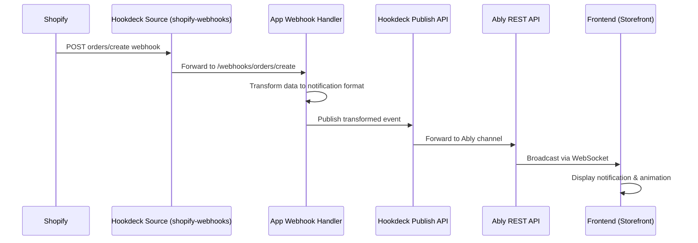

# Hookdeck-Ably Integration Architecture Design

## Executive Summary

This document outlines the architectural design for implementing a complete event flow from Shopify webhooks through Hookdeck Event Gateway to Ably real-time notifications, with live updates displayed in the storefront.

## Current State Analysis

### What's Working

1. **Connection 1**: Shopify → Hookdeck → App webhook handler

   - Source: `shopify-webhooks` (type: SHOPIFY)
   - Destination: CLI (path: `/webhooks/orders/create`)
   - Webhook verification using SHOPIFY_API_SECRET

2. **Webhook Handler**: Receives and logs order data

   - Located at: `app/routes/webhooks.orders.create.tsx`
   - Authenticates webhook using Shopify's mechanism
   - Logs payload but doesn't forward events

3. **Frontend**: Ably connection established
   - Channel: `shopify-notifications`
   - Hardcoded API key (needs improvement)
   - Logs received messages but doesn't display them

### Critical Gaps

1. **Missing Connection 2**: App → Hookdeck → Ably
2. **No event publishing**: Webhook handler doesn't forward events
3. **No data transformation**: Raw Shopify data isn't formatted for notifications
4. **No UI updates**: Frontend doesn't display actual notification content

## Proposed Architecture

### System Flow Diagram



## Detailed Component Design

### 1. Hookdeck Connections Architecture

#### Connection 1: Shopify → App (Existing)

```javascript
{
  name: "shopify-orders-create",
  source: {
    name: "shopify-webhooks",
    type: "SHOPIFY",
    config: {
      auth: {
        webhook_secret_key: SHOPIFY_API_SECRET
      }
    }
  },
  destination: {
    name: "shopify-orders-create-cli",
    type: "CLI",
    config: {
      path: "/webhooks/orders/create"
    }
  }
}
```

#### Connection 2: App → Ably (New)

```javascript
{
  name: "ably-notifications",
  source: {
    name: "app-events",
    type: "PUBLISH_API"
    // No auth config needed - uses Bearer token when publishing
  },
  destination: {
    name: "ably-rest",
    type: "HTTP",
    config: {
      url: "https://rest.ably.io/channels/shopify-notifications/messages",
      auth: {
        type: "BASIC",
        config: {
          username: ABLY_API_KEY.split(':')[0], // App ID + Key ID
          password: ABLY_API_KEY.split(':')[1]  // Key Secret
        }
      },
      headers: {
        "Content-Type": "application/json"
      }
    }
  }
}
```

### 2. Data Transformation Pipeline

#### Input: Shopify Order Webhook Payload

Key fields from the webhook:

- Order ID, number, name
- Customer name, email
- Total price, currency
- Line items (products)
- Creation timestamp

#### Transformation Logic

```typescript
interface ShopifyOrder {
  id: number;
  name: string;
  email: string;
  total_price: string;
  currency: string;
  customer: {
    first_name: string;
    last_name: string;
  };
  line_items: Array<{
    title: string;
    quantity: number;
    price: string;
    product_id: number;
  }>;
}

interface NotificationPayload {
  type: "order_created";
  orderId: string;
  orderNumber: string;
  customerName: string;
  totalAmount: string;
  currency: string;
  itemCount: number;
  primaryProduct: {
    title: string;
    price: string;
    image?: string; // Fetched via Shopify Admin API if needed
  };
  timestamp: string;
  shopDomain: string;
}
```

#### Transformation Function

```typescript
async function transformOrderToNotification(
  order: ShopifyOrder,
  shop: string,
  admin: AdminApiClient,
): NotificationPayload {
  // Get first product details for display
  const primaryItem = order.line_items[0];

  // Optionally fetch product image
  let productImage = null;
  if (primaryItem?.product_id) {
    try {
      const product = await admin.request(
        `query getProduct($id: ID!) {
          product(id: $id) {
            featuredImage {
              url
              altText
            }
          }
        }`,
        {
          variables: { id: `gid://shopify/Product/${primaryItem.product_id}` },
        },
      );
      productImage = product.data?.product?.featuredImage?.url;
    } catch (e) {
      console.error("Failed to fetch product image:", e);
    }
  }

  return {
    type: "order_created",
    orderId: order.id.toString(),
    orderNumber: order.name,
    customerName:
      `${order.customer?.first_name || "Guest"} ${order.customer?.last_name || ""}`.trim(),
    totalAmount: order.total_price,
    currency: order.currency,
    itemCount: order.line_items.reduce((sum, item) => sum + item.quantity, 0),
    primaryProduct: {
      title: primaryItem?.title || "Order",
      price: primaryItem?.price || order.total_price,
      image: productImage,
    },
    timestamp: new Date().toISOString(),
    shopDomain: shop,
  };
}
```

### 3. Hookdeck Publish API Integration

#### Publishing Events from Webhook Handler

```typescript
// app/routes/webhooks.orders.create.tsx

import { publishToHookdeck } from "~/helpers/hookdeck-publisher";

export const action = async ({ request }: ActionFunctionArgs) => {
  const { topic, shop, admin, payload } = await authenticate.webhook(request);

  if (!admin) {
    throw new Response();
  }

  console.log(`Received ${topic} webhook for ${shop}`);

  try {
    // Transform Shopify order to notification format
    const notification = await transformOrderToNotification(
      payload,
      shop,
      admin,
    );

    // Publish to Hookdeck Publish API
    await publishToHookdeck(notification);

    console.log(`Published notification for order ${notification.orderNumber}`);
  } catch (error) {
    console.error("Failed to process order webhook:", error);
    // Don't throw - webhook should still return 200 to Shopify
  }

  return new Response();
};
```

#### Hookdeck Publisher Helper

```typescript
// app/helpers/hookdeck-publisher.ts

const HOOKDECK_PUBLISH_URL = process.env.HOOKDECK_PUBLISH_URL; // From setup script
const HOOKDECK_SOURCE_NAME = "app-events"; // Name of the Publish API source

export async function publishToHookdeck(data: any) {
  if (!HOOKDECK_PUBLISH_URL) {
    throw new Error("HOOKDECK_PUBLISH_URL not configured");
  }

  const response = await fetch(HOOKDECK_PUBLISH_URL, {
    method: "POST",
    headers: {
      "Content-Type": "application/json",
      "X-Hookdeck-Source-Name": HOOKDECK_SOURCE_NAME, // Required for Publish API
    },
    body: JSON.stringify({
      // Ably expects message in specific format
      name: "order_notification",
      data: JSON.stringify(data), // Ably requires string data
    }),
  });

  if (!response.ok) {
    throw new Error(`Failed to publish to Hookdeck: ${response.status}`);
  }

  return response.json();
}
```

### 4. Frontend Notification Display

#### Enhanced Notification Handler

```javascript
// extensions/live-notifications/assets/notifications.js

const connectAbly = async () => {
  const ably = new Ably.Realtime(ABLY_API_KEY); // Should be injected securely

  ably.connection.once("connected", () => {
    console.log("Connected to Ably!");
  });

  const channel = ably.channels.get("shopify-notifications");

  await channel.subscribe("order_notification", (message) => {
    try {
      const notification = JSON.parse(message.data);
      displayNotification(notification);
      createNotificationSnowflake(notification);
    } catch (error) {
      console.error("Failed to parse notification:", error);
    }
  });
};

function displayNotification(notification) {
  // Create notification element
  const notificationEl = document.createElement("div");
  notificationEl.className = "live-notification";
  notificationEl.innerHTML = `
    <div class="notification-content">
      ${
        notification.primaryProduct.image
          ? ``
          : ""
      }
      <div class="notification-text">
        <strong>${notification.customerName}</strong> just ordered
        <span class="product-name">${notification.primaryProduct.title}</span>
        ${notification.itemCount > 1 ? `and ${notification.itemCount - 1} more items` : ""}
      </div>
      <div class="notification-price">
        ${notification.currency} ${notification.totalAmount}
      </div>
    </div>
  `;

  // Add to container and animate
  const container = document.getElementById("notifications_display");
  container.appendChild(notificationEl);

  // Auto-remove after 10 seconds
  setTimeout(() => {
    notificationEl.classList.add("fade-out");
    setTimeout(() => notificationEl.remove(), 500);
  }, 10000);
}

function createNotificationSnowflake(notification) {
  const flake = document.createElement("div");
  flake.classList.add("flake", "notification-flake");

  // Add product image or icon to snowflake
  if (notification.primaryProduct.image) {
    flake.style.backgroundImage = `url(${notification.primaryProduct.image})`;
    flake.style.backgroundSize = "cover";
  } else {
    flake.innerHTML = "🎁"; // Fallback emoji
  }

  // Add click handler with notification details
  flake.addEventListener("click", () => {
    console.log("Order notification clicked:", notification);
    // Could show modal with full order details
  });

  document.getElementById("notifications_snowfall").appendChild(flake);
}
```

### 5. Environment Configuration

#### Required Environment Variables

```env
# Shopify App Credentials
SHOPIFY_API_KEY=your_shopify_api_key
SHOPIFY_API_SECRET=your_shopify_api_secret

# Hookdeck Configuration
HOOKDECK_API_KEY=your_hookdeck_api_key
HOOKDECK_PUBLISH_URL=https://events.hookdeck.com/e/src_xxxxx  # Set by setup script

# Ably Configuration
ABLY_API_KEY=your_ably_api_key  # Format: appId.keyId:keySecret
ABLY_PUBLIC_KEY=your_ably_public_key  # For frontend (restricted permissions)
```

### 6. Setup Script Updates

The setup script needs to create TWO connections and return both URLs:

```typescript
// scripts/setup-hookdeck.ts additions

async function createAblyConnection(apiKey: string): Promise<string> {
  console.log("Creating Ably forwarding connection...");

  const ablyApiKey = process.env.ABLY_API_KEY;
  if (!ablyApiKey) {
    throw new Error("ABLY_API_KEY is required for Ably connection");
  }

  // Parse Ably API key
  const [credentials, secret] = ablyApiKey.split(":");

  const response = await fetch(`${CONFIG.hookdeckApiUrl}/connections`, {
    method: "PUT",
    headers: {
      Authorization: `Bearer ${apiKey}`,
      "Content-Type": "application/json",
    },
    body: JSON.stringify({
      name: "ably-notifications",
      source: {
        name: "app-events",
        type: "PUBLISH_API",
      },
      destination: {
        name: "ably-rest",
        type: "HTTP",
        config: {
          url: "https://rest.ably.io/channels/shopify-notifications/messages",
          auth: {
            type: "BASIC",
            config: {
              username: credentials,
              password: secret,
            },
          },
          headers: {
            "Content-Type": "application/json",
          },
        },
      },
    }),
  });

  const connection = await response.json();
  return connection.source.url; // This is the Publish API URL
}

// Helper to update .env file
async function updateEnvFile(key: string, value: string) {
  const envPath = ".env";
  let envContent = "";

  try {
    envContent = await readFileSync(envPath, "utf-8");
  } catch (e) {
    // .env doesn't exist, create it
  }

  // Check if key already exists
  const regex = new RegExp(`^${key}=.*$`, "gm");
  if (regex.test(envContent)) {
    // Update existing value
    envContent = envContent.replace(regex, `${key}=${value}`);
  } else {
    // Add new key
    envContent += `\n${key}=${value}`;
  }

  await writeFileSync(envPath, envContent, "utf-8");
  console.log(`Updated .env with ${key}`);
}

// Update main() to create both connections
async function main() {
  // ... existing validation ...

  // Create Shopify webhook connection
  const shopifySourceUrl = await createHookdeckConnection(
    apiKey,
    shopifySecret,
  );

  // Create Ably forwarding connection
  const publishApiUrl = await createAblyConnection(apiKey);

  // Save publish URL to .env so the webhook handler can use it
  await updateEnvFile("HOOKDECK_PUBLISH_URL", publishApiUrl);

  // ... update shopify.app.toml ...

  console.log("Setup Complete!");
  console.log(`Shopify Webhook URL: ${shopifySourceUrl}`);
  console.log(`Hookdeck Publish URL: ${publishApiUrl}`);
  console.log(`.env file updated with HOOKDECK_PUBLISH_URL`);
}
```

## Implementation Steps

### Phase 1: Infrastructure Setup

1. Update environment variables with Ably API key
2. Extend setup script to create second Hookdeck connection
3. Store Publish API URL in environment

### Phase 2: Backend Implementation

1. Create hookdeck-publisher helper module
2. Implement data transformation function
3. Update webhook handler to publish events
4. Add error handling and logging

### Phase 3: Frontend Enhancement

1. Create notification display component
2. Enhance snowflake animations with product data
3. Add notification queue management
4. Implement secure API key injection

### Phase 4: Testing & Refinement

1. Test end-to-end flow with test orders
2. Monitor Hookdeck dashboard for event flow
3. Verify Ably message delivery
4. Optimize notification display timing

## Security Considerations

1. **API Key Management**:

   - Never expose Hookdeck API key in frontend
   - Use restricted Ably key for frontend (subscribe-only)
   - Store sensitive keys in environment variables

2. **Data Privacy**:

   - Don't send sensitive customer data in notifications
   - Use customer first name only or "A customer"
   - Avoid sending email or full addresses

3. **Rate Limiting**:
   - Implement rate limiting in webhook handler
   - Queue notifications to prevent overwhelming frontend
   - Use Hookdeck's built-in rate limiting features

## Performance Optimizations

1. **Async Processing**:

   - Don't block webhook response for publishing
   - Use background jobs for heavy processing
   - Return 200 to Shopify immediately

2. **Caching**:

   - Cache product images/data
   - Batch API calls when possible
   - Use Hookdeck's retry mechanism

3. **Frontend Efficiency**:
   - Limit number of concurrent notifications
   - Throttle animation creation
   - Clean up old DOM elements

## Monitoring & Debugging

### Key Metrics to Track

- Webhook delivery success rate
- Publish API success rate
- Ably connection stability
- Frontend notification display rate

### Debug Points

1. Shopify webhook logs
2. App webhook handler logs
3. Hookdeck dashboard events
4. Ably dashboard statistics
5. Browser console for frontend

## Conclusion

This architecture provides a robust, scalable solution for real-time notifications from Shopify to storefront. The dual Hookdeck connection pattern ensures reliable delivery with proper queuing and retry mechanisms, while Ably handles the real-time broadcast to multiple clients efficiently.

The modular design allows for easy testing, monitoring, and future enhancements such as:

- Multiple notification types (orders, refunds, reviews)
- Shop-specific channels for multi-tenant support
- Advanced animations based on order value
- Analytics tracking for notification engagement
