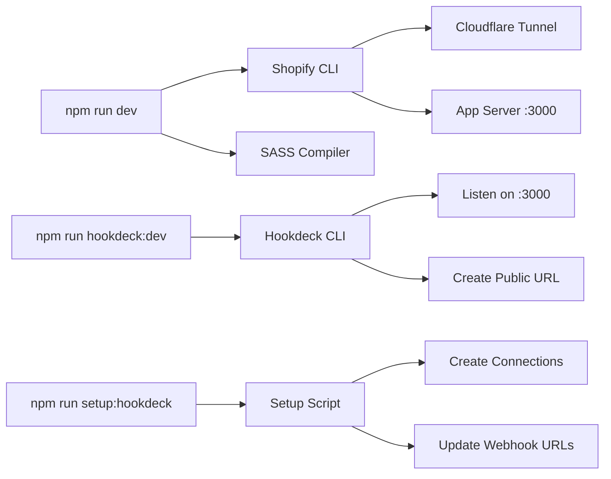
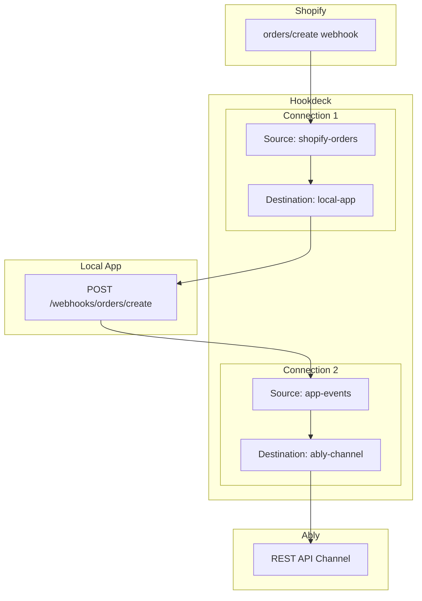

# Hookdeck Connection Setup Script Architecture

## Executive Summary

This document outlines the architecture for creating a Hookdeck connection setup script for the Shopify live notifications app. The script will automate the creation and configuration of Hookdeck connections to handle webhook routing from Shopify to the local development environment and to Ably for real-time notifications.

## Current Architecture Analysis

### Application Stack

- **Backend**: Remix app running on port 3000 (configurable via PORT env var)
- **Shopify CLI**: Creates Cloudflare tunnel for OAuth and admin interface
- **Webhook Handlers**: Located at `/webhooks/orders/create` and `/webhooks/app/uninstalled`
- **Real-time Messaging**: Ably for pub/sub to storefront
- **Event Gateway**: Hookdeck for reliable webhook delivery and routing

### Current Webhook Flow

1. Shopify → Hookdeck Source (ingestion)
2. Hookdeck → Local App (via Hookdeck CLI during dev)
3. App processes webhook
4. App → Hookdeck → Ably (forwarding to real-time channel)
5. Ably → Storefront clients (real-time notifications)

## Key Architecture Decisions

### 1. Shopify Webhook URL Configuration

**Finding**: Shopify webhook configurations in [`shopify.app.toml`](../shopify.app.toml:16-22) use relative URIs, while the `application_url` points to the Cloudflare tunnel.

**Architecture Decision**:

- **Development**: Use Hookdeck CLI to create a public endpoint that forwards to localhost:3000
- **Production**: Use static Hookdeck Source URLs configured per environment

**Rationale**:

- Shopify's webhook system supports absolute URLs different from the application URL
- This allows webhooks to be routed through Hookdeck while keeping the app on Cloudflare tunnel
- Provides better debugging and replay capabilities

### 2. Development Workflow Architecture

**Current State**: `npm run dev` starts Shopify CLI with Cloudflare tunnel

**Recommended Architecture**:



**Workflow Options**:

**Option A: Separate Commands (Recommended)**

```bash
# Terminal 1: Start app
npm run dev

# Terminal 2: Start Hookdeck forwarding
npm run hookdeck:dev

# One-time setup
npm run setup:hookdeck
```

**Option B: Combined Command**

```bash
# Single command using concurrently
npm run dev:full
```

**Recommendation**: Option A for better control and debugging visibility

### 3. Hookdeck Connection Architecture

**Required Connections** (focusing on orders/create only, as uninstall events are not needed):



**Note**: Using Hookdeck CLI's connection commands which automatically handle source and destination creation/updates

### 4. Setup Script Design

**Script Responsibilities**:

1. **Validate Prerequisites**

   - Check for required environment variables
   - Verify Hookdeck CLI is installed and authenticated
   - Confirm app is running on expected port

2. **Create Hookdeck Resources**

   ```javascript
   // Pseudocode structure
   async function setupHookdeck() {
     // 1. Create Sources
     const orderSource = await createSource("shopify-orders-create");
     const uninstalledSource = await createSource("shopify-app-uninstalled");
     const ablySource = await createSource("app-to-ably");

     // 2. Create Destinations
     const localOrderDest = await createDestination(
       "local-app-orders",
       "http://localhost:3000/webhooks/orders/create",
     );
     const localUninstalledDest = await createDestination(
       "local-app-uninstalled",
       "http://localhost:3000/webhooks/app/uninstalled",
     );
     const ablyDest = await createDestination("ably-rest", {
       url: "https://rest.ably.io/channels/{shopId}/messages",
       auth: "Bearer {ABLY_API_KEY}",
     });

     // 3. Create Connections
     await createConnection("orders-to-local", orderSource, localOrderDest);
     await createConnection(
       "uninstalled-to-local",
       uninstalledSource,
       localUninstalledDest,
     );
     await createConnection("app-to-ably", ablySource, ablyDest);

     // 4. Output webhook URLs for Shopify configuration
     console.log("Webhook URLs to configure in Shopify:");
     console.log(`Orders Create: ${orderSource.url}`);
     console.log(`App Uninstalled: ${uninstalledSource.url}`);
   }
   ```

3. **Handle Multiple Environments**
   - Development: Use Hookdeck CLI for local forwarding
   - Staging: Create staging-specific connections
   - Production: Create production connections with proper authentication

### 5. Environment Variables

**Required Variables**:

```env
# Shopify Configuration
SHOPIFY_API_KEY=xxx
SHOPIFY_API_SECRET=xxx
SHOPIFY_APP_URL=https://xxx.trycloudflare.com
SCOPES=read_products,read_orders

# Hookdeck Configuration
HOOKDECK_API_KEY=xxx
HOOKDECK_SIGNING_SECRET=xxx  # For webhook verification (optional)

# Ably Configuration
ABLY_API_KEY=xxx

# App Configuration
PORT=3000  # Default port for local development
NODE_ENV=development

# Shop-specific (dynamic)
SHOP_DOMAIN=xxx.myshopify.com  # Set during app install
```

### 6. Implementation Phases

**Phase 1: Basic Setup Script**

- Create connections using Hookdeck CLI
- Manual webhook URL configuration in Shopify

**Phase 2: Automated Webhook Registration**

- Use Shopify Admin API to update webhook subscriptions
- Programmatically set Hookdeck Source URLs

**Phase 3: Multi-environment Support**

- Environment-specific configurations
- Production deployment scripts

## Technical Considerations

### Security

- **Webhook Verification**: Use Hookdeck's built-in HMAC verification
- **API Keys**: Store securely, never commit to repository
- **Token Rotation**: Implement key rotation strategy for production

### Reliability

- **Retry Logic**: Leverage Hookdeck's automatic retry capabilities
- **Dead Letter Queue**: Configure DLQ for failed deliveries
- **Monitoring**: Set up alerts for webhook failures

### Scalability

- **Connection Naming**: Use consistent naming convention: `{environment}_{shop}_{event}`
- **Multi-tenant**: Design for multiple shops from the start
- **Rate Limiting**: Configure appropriate rate limits on Hookdeck destinations

## Implementation Recommendations

### 1. Directory Structure

```
/scripts
  ├── setup-hookdeck.sh       # Shell script using CLI (Option A)
  └── setup-hookdeck.ts       # TypeScript alternative (Option B)

/config
  ├── hookdeck.dev.json       # Development connections
  ├── hookdeck.staging.json   # Staging connections
  └── hookdeck.prod.json      # Production connections
```

### 2. NPM Scripts

```json
{
  "scripts": {
    "setup:hookdeck": "node scripts/setup-hookdeck.js",
    "hookdeck:dev": "hookdeck listen 3000 shopify-webhooks --forward-url http://localhost:3000",
    "hookdeck:list": "hookdeck connection list",
    "dev": "npm run sass & shopify app dev",
    "dev:full": "concurrently \"npm run dev\" \"npm run hookdeck:dev\""
  }
}
```

### 3. Setup Script CLI Interface

```bash
# Basic setup for development
npm run setup:hookdeck

# Setup for specific environment
npm run setup:hookdeck -- --env=staging

# Setup for specific shop
npm run setup:hookdeck -- --shop=mystore.myshopify.com

# Verbose mode for debugging
npm run setup:hookdeck -- --verbose
```

## Limitations and Constraints

1. **Shopify Webhook Registration**

   - Webhooks defined in `shopify.app.toml` are automatically registered
   - Dynamic webhook registration requires Admin API access
   - Webhook URLs can't be environment-specific in TOML file

2. **Hookdeck CLI Limitations**

   - CLI must be authenticated before script runs
   - Local forwarding requires app to be running
   - Can't programmatically start/stop CLI sessions

3. **Development vs Production**
   - Different authentication methods needed
   - URL structures differ (localhost vs public domains)
   - Connection management strategies differ

## Next Steps

1. **Validate Architecture** with stakeholders
2. **Create Proof of Concept** setup script
3. **Test with Multiple Shops** to validate multi-tenant approach
4. **Document Setup Process** for developers
5. **Create Migration Guide** for existing installations

## Appendix A: Hookdeck CLI Commands Reference

```bash
# Authentication
hookdeck login

# Listen for local development (interactive)
hookdeck listen 3000 shopify-webhooks

# Create connection with source and destination
hookdeck connection create \
  --source-name "shopify-orders" \
  --destination-name "local-app" \
  --destination-url "http://localhost:3000/webhooks/orders/create"

# Update existing connection
hookdeck connection update CONNECTION_ID \
  --destination-url "http://localhost:3001/webhooks/orders/create"

# List connections
hookdeck connection list

# Get connection details as JSON
hookdeck connection list --json
```

## Appendix B: Alternative Approaches Considered

### 1. Dynamic Connection Creation

**Approach**: Create connections on app install
**Rejected Because**:

- App install callbacks can be unreliable
- Difficult to debug and maintain
- Doesn't handle reinstalls well

### 2. Single Hookdeck Source for All Events

**Approach**: Route all webhooks through one source
**Rejected Because**:

- Less granular control
- Harder to debug specific event types
- Can't apply event-specific transformations

### 3. Direct Shopify to Ably Integration

**Approach**: Skip local processing, send directly to Ably
**Rejected Because**:

- No data transformation capability
- Can't add business logic
- No local logging/debugging

## Conclusion

The recommended architecture provides a robust, scalable solution for managing webhook routing in the Shopify live notifications app. The setup script approach ensures consistent configuration across environments while maintaining flexibility for development and debugging.

The separation of concerns between the Cloudflare tunnel (for app functionality) and Hookdeck (for webhook handling) provides the best of both worlds: Shopify's native development experience and enterprise-grade webhook infrastructure.
